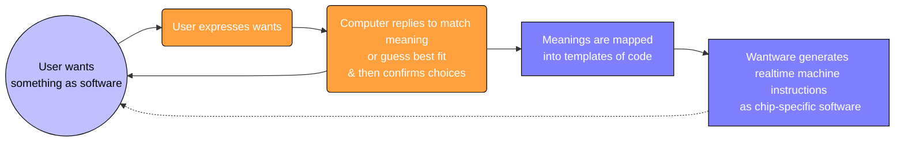

[comment]: # (title : WANTWARE_REPORT)
[comment]: # (author: jake kolb v)
[comment]: # (version: v1.0)
[comment]: # (company:MINDAPTIV)
[comment]: # (client: Audience of Interest)

#  B00: Introduction to wantware
## Table of Contents to Understand Scale and Scope of wantware as a Solution

---------

BASIC CONTENTS:
  * B01 **WHAT**: *[Categorize what can be represented in computer bits.](B01_WHAT.html)*
  * B02 **HOW**: *[Show the flow when running on 1 or more computers.](B02_HOW.html)*
  * B03 **WHERE**: *[Where interfaces access libraries, APIs, network services, devices and realtime generated software.](B03_WHERE.html)*
  * B04 **WHY**: *[Reasons we believe this matters.](B04_WHY.html)*
  * B05 **WHO**: *[Personal usecases for wantware use.](B05_WHO.html)*
  * B06 **WHEN**: *[Timeline of development and achievements.](B06_WHEN.html)*

---------
EXAMPLE CONTENTS:
  * E00 **EXAMPLE__MENU**: *[Diagrams how a simple Menu App runs.](E00_MENU.html)*
  * E01 **EXAMPLE__VIDEO**: *[Diagrams how the Warpspeed video conferencing runs.](E01_VIDEO.html)*
  * E02 **EXAMPLE__MOON**: *[Diagrams how a Lunar Mining Simulation might be digital twinned.](E02_MOON.html)*

  ---------

