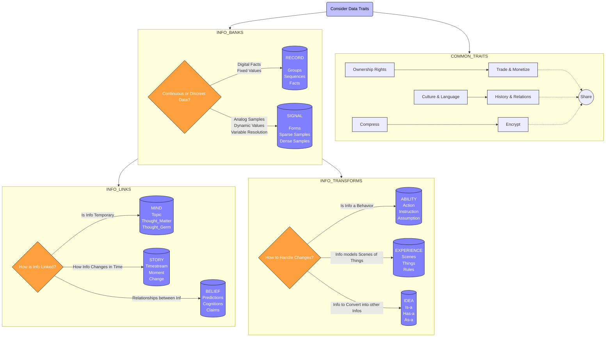

[comment]: # (title : wantware Report)
[comment]: # (author: j kolb v)
[comment]: # (version: v1.0)
[comment]: # (company:MINDAPTIV)
[comment]: # (client: Audience of Interest)

#  B01: WHAT describes what can be represented whether as data or behavior
## What kinds of knowledge or behaviors can be stored as computer bits

Box|Description|Examples
----------|--------|-----
 Mind Box | Minds emulate thinking. **Topic**: Topics operate in parallel as a graph of thought heaps for a given context. **Thought_Matter**: Thought Matter reference other thoughts, such as a pronoun or descriptor such as all large red dogs. **Thought_Germ**: Germs are temporary values small enough to be stored inside of an infosign to be rapidly processed by a brain.|*List of Suspects and Deeds in a Mystery. Tasks, Priorities, and Concerns considered to choose next action.*
 Record Box | Records are databases for discrete info with specific and unique answers, unlike in Beliefs where simultaneous answers may exist. **Groups**: An ordered table of sequence rows. **Sequence**: A variable-length sequence of facts. **Fact**: Discrete information stored in time objectively. |*Name and Address for Contacts, Todo List, Objects detected by a Camera with datetime and accuracy.*
 Signal Box | Forms of continuous ideas sampled in multiple dimensions. **Form**: A grouping of sample values in a continuous signal that act as one value. **Sparse Samples**: The lowest resolution values of a region in a continuous signal. **Dense Samples**: The highest resolution values of a region in a continuous signal.|*Coyote Shape, Skeleton, Fur Material Colors*
 Ability Box | Collections of behaviors using context specific information that changes spacetime. **Action**: A single action is a set of instructions and assumptions to transform data. **Instruction**: A single instruction of an Action. **Assumptions**: Action Arguments; Actual Parameters; Data Constants; These inputs and outputs describe predefined pieces of information for use by instructions.|*How Coyotes Run, Howl, Hide, and Sleep*
 Story Box | Variable histories of possible changes that recreate an experience in spacetime. **Timeestream**: collection of moments and their contained changes for a particular version of time and space. **Moment**:A collection, often over time, of changes. **Change**: Actual change in values stored for timestream, undo, and redo purposes.|*Timeline playback for a range of slightly different events if the coyote went left, right, or straight on the path*
 Experience Box | Collections of scenes containing things that change with time. **Scene**: A collection of things and rules that create a scene in spacetime. **Thing**: A specific example of an idea that exists in time and space. **Rule**: A triggered condition that prompts additional changes.|*Coyotes in a forest with growing plants, a night & day cycle and weather.*
 Belief Box | Unstructured network of observations, opionions and predictions made by the various rules which generate a thing's beliefs. **Prediction**: Expectations based on relations for a thing.  Answers to queries. **Cognition**: Relations between units which a thing either observered or concluded by a set of rules. **Claim**: A unit of information used in any cognition above, might be a fact or might be unknown, mysterious or with broken relations. Forms contemplative queries.|*Opinions on Coyotes, what they eat, where to find them, and their likability.*
 Idea Box | Collections of other ideas that form a unique concept. **Has-a**: An idea contained by an encompassing parent Idea **Is-a**: An idea contained by a parent Idea **As-a**: An idea converted into another Idea.|*Cartoon Coyote vs Science-Model of Coyote Behavior vs Coyote Mascot Customizer*

  *[Click here to return to Table of Contents](B00_INTRO.html)*