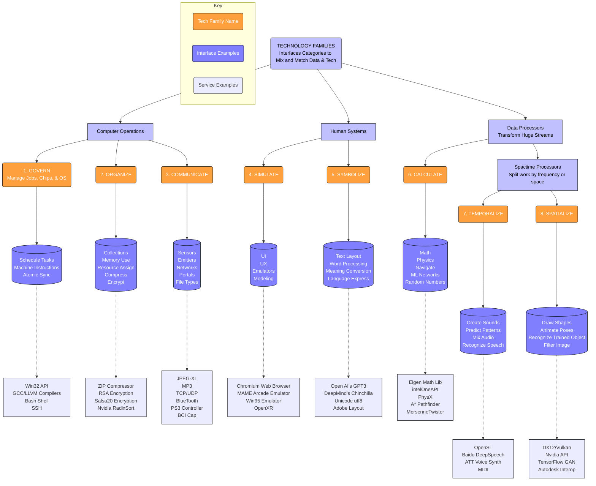

[comment]: # (title : WANTWARE_REPORT)
[comment]: # (author: jake kolb v)
[comment]: # (version: v1.0)
[comment]: # (company:MINDAPTIV)
[comment]: # (client: Audience of Interest)

#  B03: WHERE does wantware run with what technologies?
### Shows how interfaces map to existing or new technologies

SubSystem|Description
---|---
   Govern|Manage Work such as Host-Computer operations, Data-Processing tasks, Conditional evaluations, and resource balancing services. Enables code processing, such as timers, profilers, threads, and management of tasks.
   Organize|Categorize and Order Information as services such as which asset is loaded where in what format and who is accessing them according to schedule. Enables data processing, such as access, locations, reorderings, and translations of data.
   Communicate|Talk, Input/Output, Buffer, Communicate, and send and receive messages. Device, Storage, and Data Stream communication services. Enables stream processing in all Communication streams of data, whether files, input controllers, networks, or other such devices.
   Simulate|Reproduce events in a scene from a an experience. Includes processing actions, whether thinking, doing, feeling, or other changes to data as services. Enables simulation processing as changes to a container of data following rules, styles, and other behaviors. Simulate represents the fidelity tradeoffs for simulating events in a Spacetime.
   Symbolize|Remap, Lookup, translate or interpret meanings cultural and symbolic translation and relating services. Enables symbolic processing, such linguistic, cultural, and database processing.  Symbolize is primarily text formating, pattern-matching, cultural conversions, & lexical conventions.  Designed to work on symbols.
   Calculate|Equation solving, physics model, and computing probabilities.Enables numerical processing, such as formulas, solvers, generation of randomness, physics simulations, and navigation.  Calculate is designed to handle data accuracy and solution selections.
   Temporalize|Time-dominant services such as sound processing and spectrum analysis. Enables time processing, such as audio creations, environmental modeling, speech or instrument synthesis, and voice recognition.  Designed to handle data changing most significantly in time.
   Spatialize|Space-dominant signal services such as graphics processing and visualization. Enables Space processing, such as visual creations, light propagation, sight recognition, and mapping database information to graphical models.  Designed to handle data changing most significantly in space.

  *[Click here to return to Table of Contents](B00_INTRO.html)*
