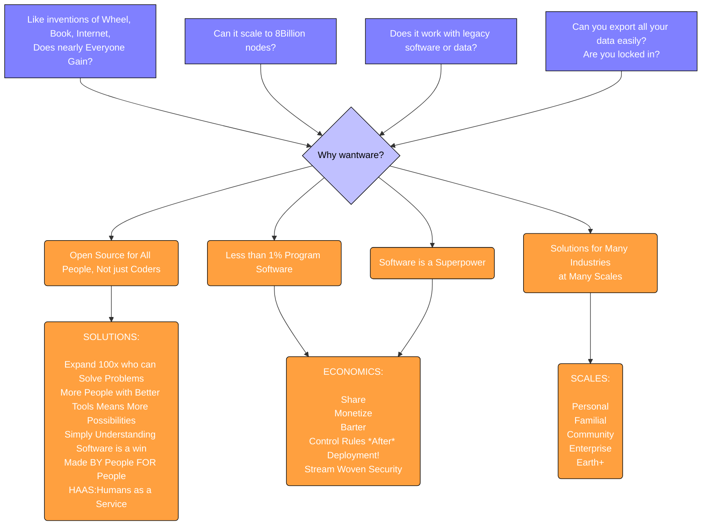

[comment]: # (title : WANTWARE_REPORT)
[comment]: # (author: jake kolb v)
[comment]: # (version: v1.0)
[comment]: # (company:MINDAPTIV)
[comment]: # (client: Audience of Interest)

#  B04: WHY wantware
## What problems does wantware solve as a global economy of solutions

---------

  *[Click here to return to Table of Contents](B00_INTRO.html)*