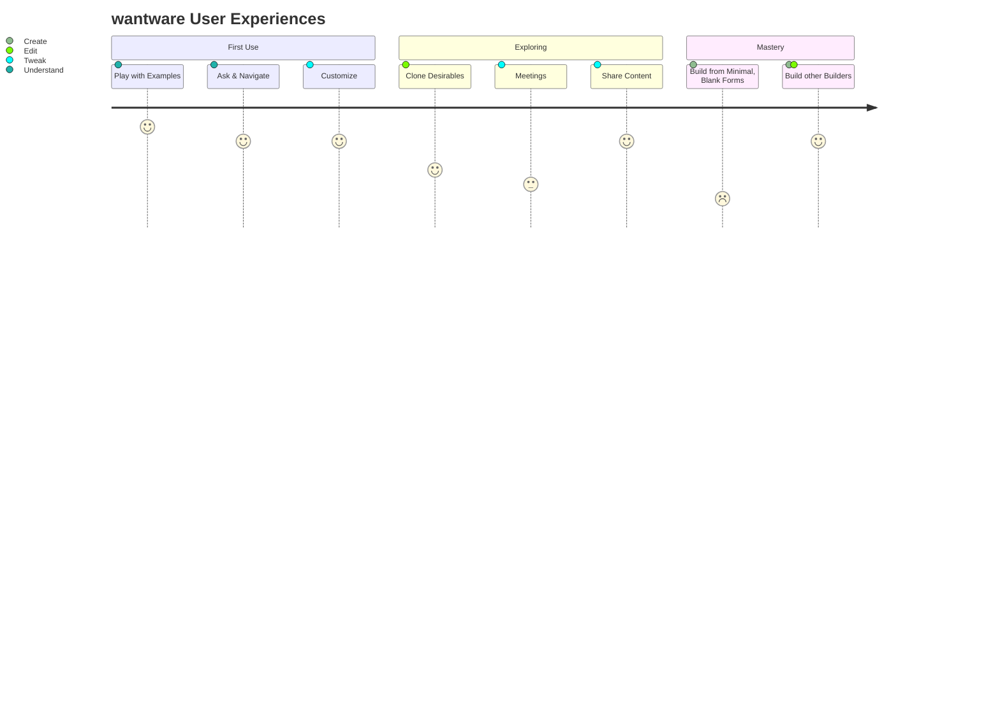
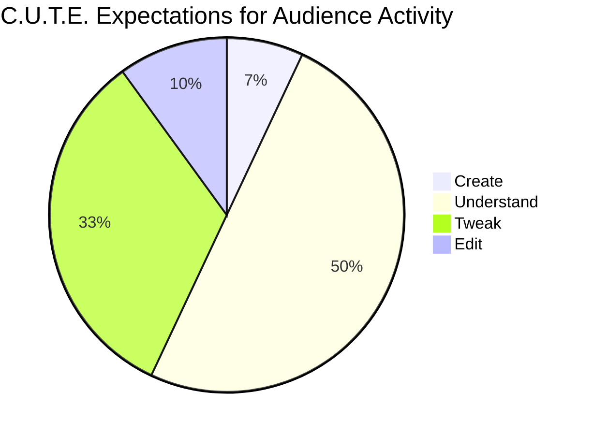
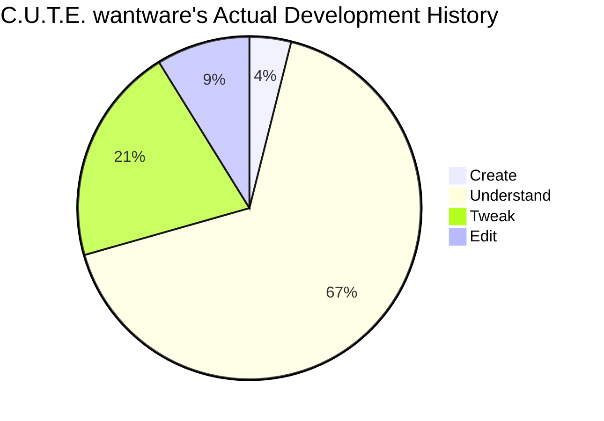

[comment]: # (title : WANTWARE_REPORT)
[comment]: # (author: jake kolb v)
[comment]: # (version: v1.0)
[comment]: # (company:MINDAPTIV)
[comment]: # (client: Audience of Interest)

#  B05: WHO Uses wantware
## Considers types of use and frequency for efficiency and comfort.

Usecase|Description|Examples
---|---|---
Understand|Ask questions at different levels of detail| Why did that picture dissapear? Who has read this text?
Tweak|Make small cosmetic/form changes|Change the hair color to red! Move it a bit to the left.
Edit|Make large behavioral/function changes|Let's modify earth weather to simulate a stomach's gases/temp/cycles.
Create|Create entirely new concepts|Let's put an EEG cap on a dog to train and correlate brain-events to language with a speech synthesizer.

  *[Click here to return to Table of Contents](B00_INTRO.html)*