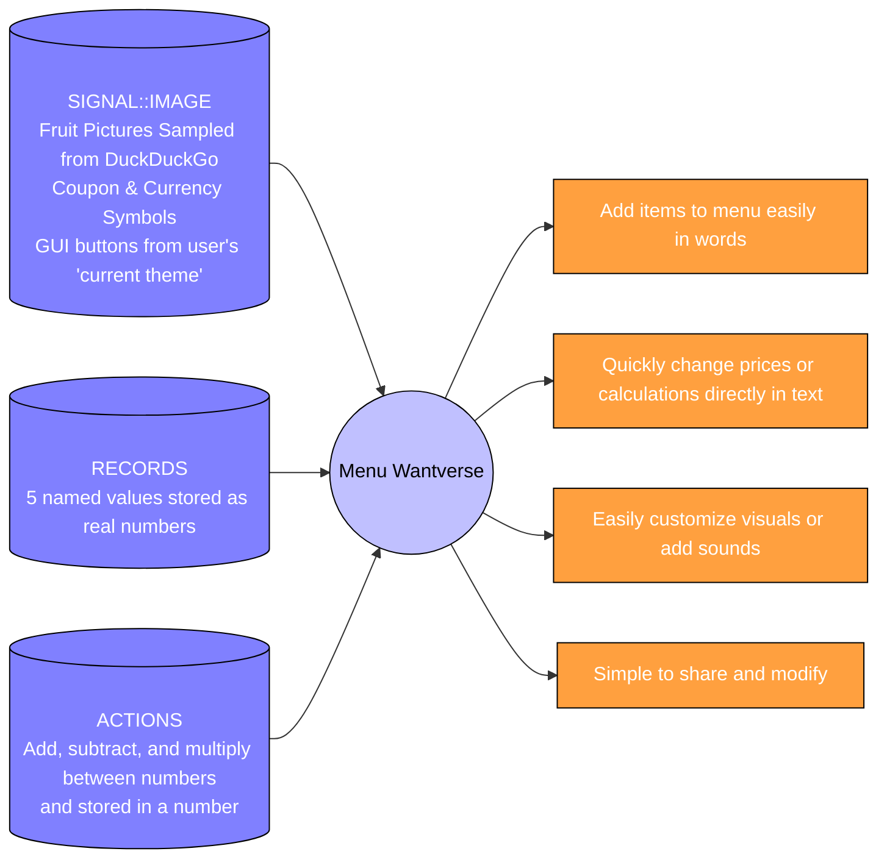

[comment]: # (title : WANTWARE_REPORT)
[comment]: # (author: jake kolb v)
[comment]: # (version: v1.0)
[comment]: # (company:MINDAPTIV)
[comment]: # (client: Audience of Interest)

#  E00: MENU shows what happens when expressing the standard wantware menu example
## Covers what is made and what can be done


We made a "Menu" Aptiv in wantware with these words:
```

1) Make APTIV #3 called SNACKSTORE.
2) Add number called Bill set it to 0.
3) Another number named Apple, set it to 3. On press increase Bill by Apple.
4) Next button called Pineapple, set to 7. When used, grow Bill by Pear.
5) Final button called Coupon, value 2. When bought, reduce Bill by Coupon.
6) One last thing, add an item called TAX. Set to 5 percent and When bought, multiply Bill by TAX
```

---------



  *[Click here to return to Table of Contents](B00_INTRO.html)*