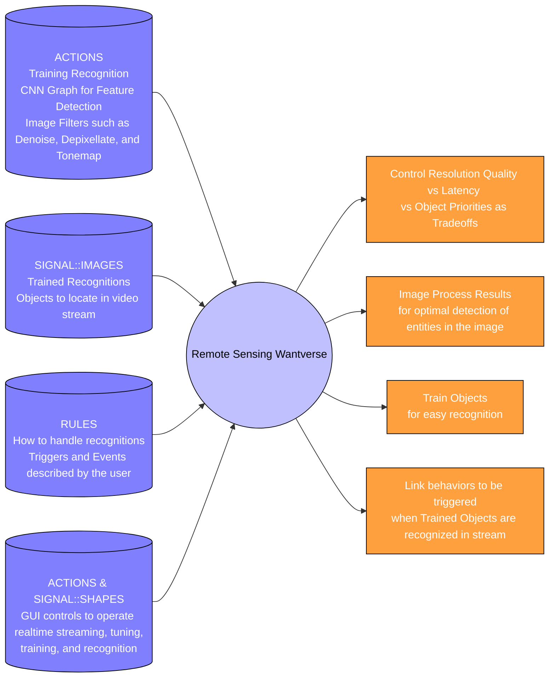

[comment]: # (title : WANTWARE_REPORT)
[comment]: # (author: jake kolb v)
[comment]: # (version: v1.0)
[comment]: # (company:MINDAPTIV)
[comment]: # (client: Audience of Interest)

#  E01: REMOTE_SENSING offers video chat and filtering for decision making based on visuals.
## Covers what is made and what can be done

We made a "Remote Sensing" wantware that provides Video Conferencing, Text Chat, Auto or Manual Adjusting Tradeoffs on Quality vs Latency, Object Recognition Training and Image Processing Filters for a desired aesthetic look.

---------

  *[Click here to return to Table of Contents](B00_INTRO.html)*