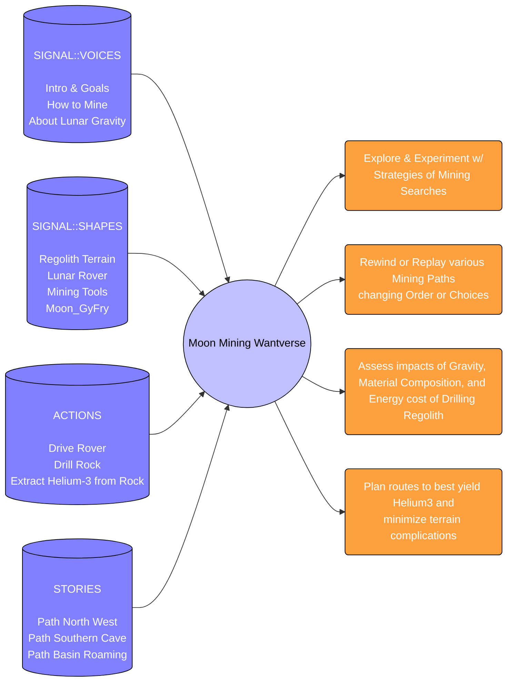

[comment]: # (title : WANTWARE_REPORT)
[comment]: # (author: jake kolb v)
[comment]: # (version: v1.0)
[comment]: # (company:MINDAPTIV)
[comment]: # (client: Audience of Interest)

#  E02: MOON_MINER is a Simulated Lunar Mining Operation.
## Covers what is made and what can be done

Consider a Moon-Mining Simulation Aptiv made in wantware to help a space organization plan how to mine Helium-3 from the lunar surface.

---------

  *[Click here to return to Table of Contents](B00_INTRO.html)*