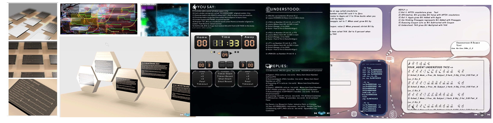

# LabEast's 'Wantware' Website
*Simulacrum0's Website for Wantware Deployment*
Handles a website for downloading the program, obtaining a store package and other deployment needs. Additionally contains documents, diagrams and other details to learn about the system.

| **Places** | *Description* |
|:--------|:-------:|
| Root | Web Pages for LabEast's Wantware Download site |
| Mx00__ToKz_DATA | Data tables such as such as Reports |
| Mx01__SuKz_MEDIA | Content such as backgrounds, symbols, fonts, sounds and pictures |
| Mx02__TxKuCho_WVERSE | Wantverse clones for default distribution |
| Mx03__DruDz_DOCS | Documents such as overviews, technology, and reports |
| Mx04__TrxFe_ISSUES | Warnings, bugs, caveats and other information related to issues faced by any user |
| Mx05__KoDz_EXE | Programs are the actual 'binary executable program' that launches Wantware |
| Mx06__MeSy_PKG | Package information for software stores, package managers and other externally organized distribution. |
| Mx07__SuSmi_WEBPG | Web Design Content such as HTML, CSS & JS files |

