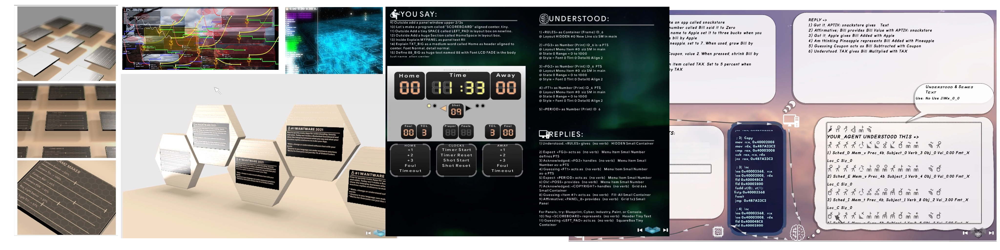

# Simulacrum0 Wantware Work
*Website for Wantware Development*

Handles a webiste for downloading and distributing content. Additionally contains materials used by developers to convert their code into wantware Powers.

| **Places** | *Description* |
|:--------|:-------:|
| Root   | Web Pages for LabEast's Wantware download site? |
| SuCho00__DruDz | Documents such as Reports |
| SuCho01__JaPe | Sounds |
| SuCho02__JaPo | Images |
| SuCho03__TxKuCho | Clones of Wantverses for distribution |
| SuCho04__WaDru | Fonts |
| SuCho05__BriDz | Program Packages |
| SuCho06__TrzChe | Build Certificates |
| SuCho07__SuSmi | Additional Web Design Content such as CSS & JS  |

