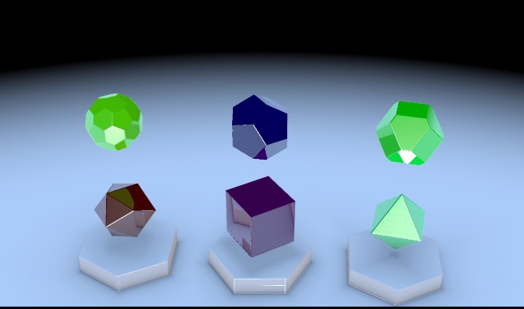

# Power_Our_People's MicroCosm🗺️SX (Shared-eXperience) Website
*MicroCosm🗺️ Shared Experiences* are for creating any digital experiences, such as mindmaps, project or data visualizers, personal information trackers, task planners, group gaming and modeling something from the real world or your imagination. Then you can share such creations with others privately without servers or snooping.

| **Places** | *Description* |
|:--------|:-------:|
| Root Folder | Web Technology & Required Files to run MicroCosm🗺️SX Website |
| Mx00__SuSmi_WEBPG | Web Page Content such as HTML, CSS, & JS files |
| Mx01__SuKz_MEDIA | Media Content such as sounds, pictures, fonts and language translations |
| Mx02__TxKuCho_WVERSE | _Deprecated LEGACY content from historical projects (soon to be erased)_ |
| Mx03__TxKu_SX | Shared Experience Content is packaged here with compression and encryption. |

