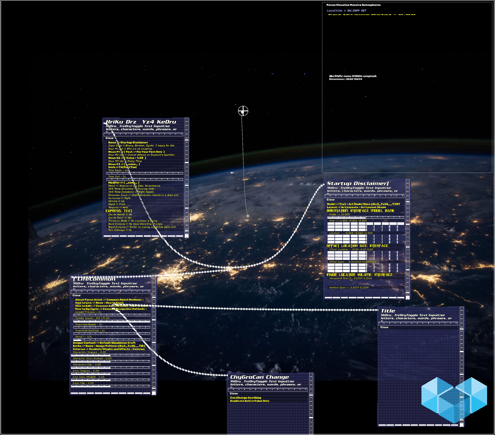

# Security Policy

## Role Based Security Limits

Use this section to tell people about which versions of your project are
currently being supported with security updates.

| Role | Features          |
| ------- | ------------------ |
| :smiley: Core | "Core Sandbox (The app is not allowed to use any services or make any changes without express permission from the user.) |
| :ghost: Ghost | Anonymous Ghost (The app allows local changes under the 'Ghost' user and is generally allowed to use any services and features provided to this user as an anonymous user.) |
| :convenience_store: Kiosk | Community Kiosk (The app is not allowed to save any changes, access any local computer information except the pre-chosen experiences, and cannot quit the experience or switch to anything.) |
| :sunglasses: Pro | Tech Professional (The app has full access to all features and editing allowed this user including projects using many external files.) |

## Reporting a Vulnerability
If you encounter any bugs, security violations or any feedback, please email 'support@MindAptiv.com' with a description of the problem and if possible, how to reproduce. We cannot guarantee any reply of message given modern email issues and spam rates. We aim to respond as able and address issues according to severity and our resources. Thanks for any efforts.

